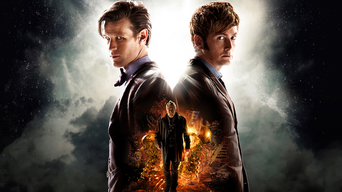

#Doctor Who: El día del Doctor

##Sinopsis

Episodio especial de "Doctor Who" realizado con motivo de la celebración 
del 50º aniversario de la serie. En la Tierra, el Undécimo Doctor y 
Clara descubren una peligrosa conspiración en una galería de arte. En 
1562, el Décimo Doctor caza Zygons con la ayuda de la Reina Isabel. El 
último día de la Guerra del Tiempo, un hombre que ya no quiere llamarse 
"El Doctor" toma una terrible decisión: debe cometer un genocidio contra 
su propia raza para impedir la destrucción del Universo. Todos estos 
sucesos resultan estar conectados cuando tres encarnaciones del mismo 
Doctor deben enfrentarse al momento más terrible de sus vidas.

* `Protagonistas` Matt Smith, David Tennant, John Hurt
* `Año` 2013
* `Director` Nick Hurran
